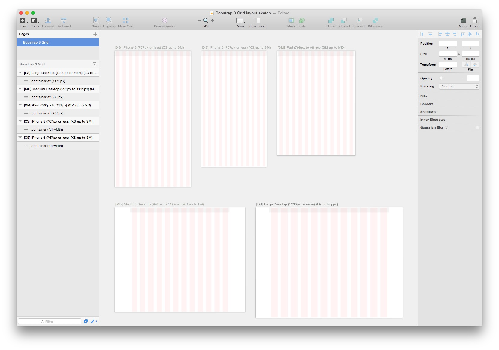

# Sketch 3 Bootstrap Grid Template
I wasn't happy with any of the existing resources out there so I created this. Use this as a starting point for designing a site in [Sketch](http://bohemiancoding.com/sketch/) that will utilize the Bootstrap 3 framework.

## Includes:

* iPhone 5 (XS) (639x1136 Artboard with full-width container)
* iPhone 6 (XS) (750x1334 Artboard with full-width container)
* iPad (SM) (768x1024 Artboard with 750px container)
* Medium Desktop (MD) (1280x1024 Artboard with 970px container)
* Large Desktop (LG) (1440x1080 Artboard with 1170px container)
